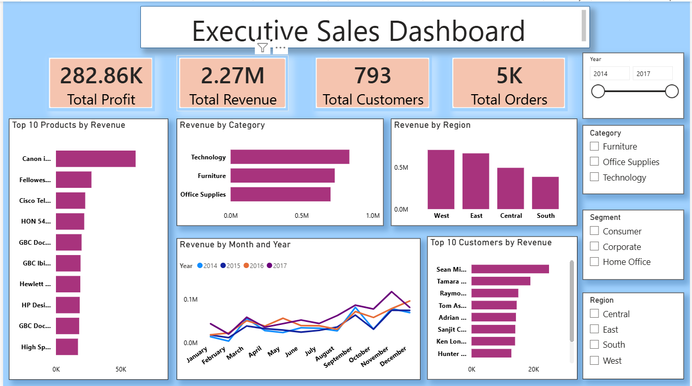
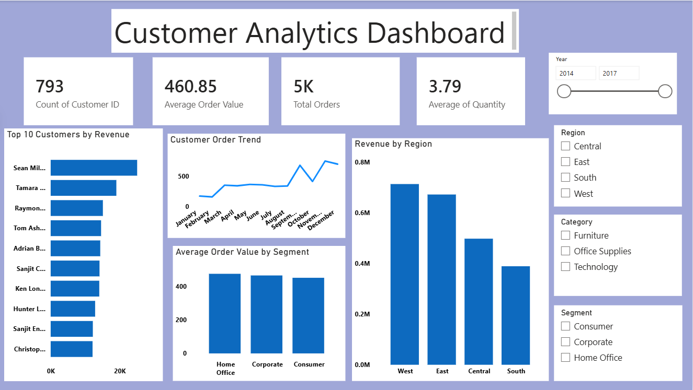
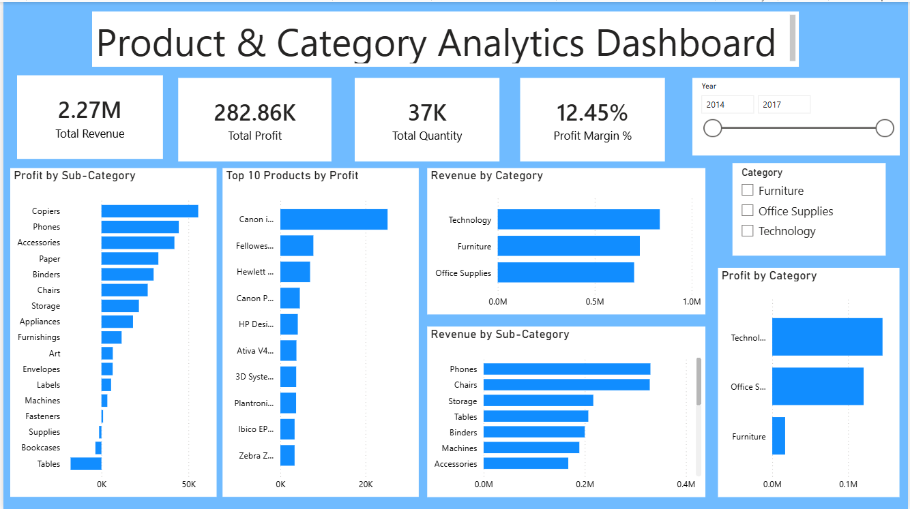

# E-Commerce Sales Analytics

An end-to-end sales analytics project using **Python, SQL, MySQL, Power BI, and DAX** to analyze sales performance, customer behavior, product performance, regional performance, and profitability.

## 📌 Project Overview

This project analyzes the **Superstore sales dataset** to transform raw sales data into meaningful business insights.

The project follows a complete data analytics workflow:

**Raw Data → Python Data Cleaning → SQL Analysis → Power BI → Business Insights**

The main objective is to understand sales and profitability patterns across customers, products, categories, sub-categories, regions, and time periods.

---

## 🎯 Business Objectives

The project focuses on answering important business questions such as:

- What is the total revenue and profit?
- Which categories generate the highest revenue?
- Which sub-categories are the most profitable?
- Which customers generate the highest revenue?
- Which products generate the highest profit?
- Which regions perform best?
- How do orders change over time?
- What is the overall profit margin?
- Which customer segments contribute the most revenue?

---

## 🛠️ Technologies Used

| Technology | Purpose |
|------------|---------|
| Python | Data cleaning and exploratory analysis |
| Pandas | Data manipulation |
| NumPy | Numerical analysis |
| SQL | Data analysis and business queries |
| MySQL | Database management |
| Power BI | Interactive dashboards |
| DAX | KPI and business calculations |
| Excel | Initial data handling |

---

## 📂 Project Structure

```text
enterprise-ecommerce-analytics/
│
├── dataset/
│   ├── README.md
│   └── cleaned_superstore.csv
│
├── python/
│   ├── clean_data.py
│   └── explore_data.py
│
├── sql/
│   ├── database.sql
│   ├── basic_queries.sql
│   ├── intermediate_queries.sql
│   ├── advanced_queries.sql
│   └── views.sql
│
├── powerbi/
│   └── E-Commerce_Sales_Analytics_Dashboard.pbix
│
├── screenshots/
│   ├── executive-dashboard.png
│   ├── customer-analytics.png
│   └── product-analytics.png
│
└── README.md
```

---

# 🔄 Project Workflow

## 1. Data Collection

The project uses the **Superstore sales dataset**, containing information about:

- Orders
- Customers
- Products
- Categories
- Sub-Categories
- Regions
- Sales
- Quantity
- Profit
- Discounts
- Order Dates

---

## 2. Data Cleaning with Python

Python was used to prepare the dataset for analysis.

The data cleaning process includes:

- Loading the dataset
- Checking missing values
- Removing unnecessary columns
- Handling duplicate records
- Correcting data types
- Cleaning column names
- Creating a cleaned dataset
- Performing basic data validation

Main files:

```text
python/clean_data.py
python/explore_data.py
```

---

## 3. SQL Analysis

The cleaned dataset is analyzed using SQL to extract business insights.

SQL analysis includes:

### Basic Analysis

- Total sales
- Total profit
- Total orders
- Category-wise sales
- Region-wise sales
- Customer-wise sales

### Intermediate Analysis

- Aggregations
- GROUP BY
- JOIN operations
- Subqueries
- Customer analysis
- Product analysis

### Advanced Analysis

- Common Table Expressions
- Window functions
- Ranking
- Top-performing products
- Profitability analysis
- Advanced business analysis

SQL views are also created for reusable analysis.

---

## 4. Power BI Dashboard

Power BI was used to create interactive dashboards for business reporting.

### Dashboard 1 — Executive Sales Dashboard

The Executive Sales Dashboard provides a high-level overview of business performance.

Key KPIs:

- Total Revenue
- Total Profit
- Total Customers
- Total Orders

Main analysis:

- Revenue by Category
- Products by Revenue
- Revenue by Region
- Sales performance overview
- Year-based filtering

---

### Dashboard 2 — Customer Analytics Dashboard

The Customer Analytics Dashboard focuses on customer and order behavior.

Key KPIs:

- Customer Count
- Average Order Value
- Total Orders
- Average Quantity

Main analysis:

- Top 10 Customers by Revenue
- Revenue by Region
- Revenue by Segment
- Customer Order Trend
- Segment filtering
- Region filtering
- Year filtering

---

### Dashboard 3 — Product & Category Analytics Dashboard

The Product & Category Analytics Dashboard focuses on product performance and profitability.

Key KPIs:

- Total Revenue
- Total Profit
- Total Quantity
- Profit Margin %

Main analysis:

- Revenue by Category
- Revenue by Sub-Category
- Profit by Sub-Category
- Profit by Category
- Top 10 Products by Profit
- Category filtering
- Year filtering

---

# 📊 Key KPIs

The project calculates important business performance indicators such as:

### Total Revenue

Measures the total sales generated from all orders.

### Total Profit

Measures the total profit generated from sales.

### Total Orders

Measures the number of orders placed.

### Total Customers

Measures the number of unique customers.

### Total Quantity

Measures the total number of products sold.

### Average Order Value

Measures the average revenue generated per order.

### Profit Margin %

Measures profitability relative to revenue.

---

# 📈 Key Business Insights

The dashboards help identify:

- Technology is one of the strongest revenue-generating categories.
- Certain sub-categories contribute significantly to overall revenue.
- Customer revenue is concentrated among high-value customers.
- Regional performance varies across different regions.
- Product profitability differs significantly between products.
- Customer order volume changes across different months.
- Profitability can be evaluated using category and sub-category analysis.

---

# 📸 Dashboard Screenshots

## Executive Sales Dashboard



## Customer Analytics Dashboard



## Product & Category Analytics Dashboard


# 💡 Business Value

This project demonstrates how raw sales data can be transformed into actionable business information.

The analysis can help businesses:

- Monitor sales performance
- Identify profitable products
- Understand customer behavior
- Compare regional performance
- Analyze category performance
- Track profitability
- Support data-driven decision making

---

# 🚀 Skills Demonstrated

This project demonstrates practical knowledge of:

- Data Cleaning
- Exploratory Data Analysis
- Python
- Pandas
- NumPy
- SQL
- MySQL
- Data Visualization
- Power BI
- DAX
- KPI Development
- Business Analysis
- Dashboard Design
- Data Storytelling

---

# 👩‍💻 Author

**Poonam Kumari Sahu**

B.Tech – Computer Science & Engineering (Data Science)

---

## ⭐ Project Summary

**E-Commerce Sales Analytics** is an end-to-end data analytics project that combines **Python, SQL, MySQL, Power BI, and DAX** to convert sales data into meaningful business insights and interactive dashboards.
